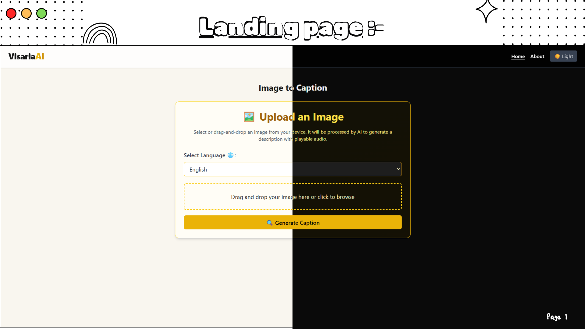
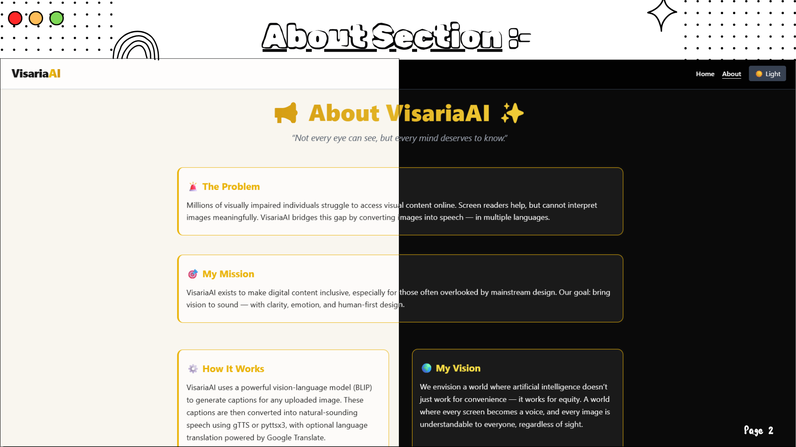

# 🔊 VisariaAI ✨
<p align=center>
  
  
  
  
  
  
<!--    -->
  
</p>

**Accessible AI for Visual Interpretation and Multilingual Audio Narration**

It is an open-source AI-powered accessibility tool that converts images into multilingual spoken descriptions using deep learning-based image captioning and text-to-speech synthesis. Built to empower visually impaired users, it bridges the gap between visual content and human understanding.
> Forked from [Clairvoyance](https://github.com/awkwardish/Clairvoyance_prototype), reimagined for multilingual accessibility and overall improvements.


## 🛠 Features 

- 🖼️ AI Image Captioning (BLIP model)
- 🔉 Text-to-Speech Output (via `gTTS`)
- 🌐 Multilingual Support: English, Hindi, Bengali (for now)
- 🎨 Modern UI with Dark Mode for better visibility
- 📑 Drag-and-drop support for the Image files
- 🔐 Simple, accessible web interface tailored for low-vision and blind users


## 🔧 Setup Instructions

### 1. 🖥️ Clone the Repository :

```
git clone https://github.com/soumyajiitdas/VisariaAI-Img2Audio.git
cd VisariaAI-Img2Audio/visaria-ai
```

### 2. 🧩 Frontend Setup (Next.js + Tailwind) :

```
cd frontend
npm install
npm run dev
```

- 🔗 App will start at : [http://localhost:3000](http://localhost:3000) 🚀


### 3. 🧩 Backend Setup (FastAPI) :

```
cd..                  # if you are in frontend folder
cd backend
python -m venv venv           # create a 'venv' python virtual env.
.\venv\Scripts\Activate           # for Windows
pip install -r requirements.txt
uvicorn main:app --reload
```

- 🔗 API will be running at : [http://localhost:8000](http://localhost:8000) 🚀


## 🗃️ Project Structure

```
visaria-ai/
├── backend/         # FastAPI backend
|   ├── api/routs
|   ├── models
|   ├── main.py
|   └── requirements.txt
|
└── frontend/        # Next.js + Tailwind frontend
    ├── components
    ├── pages
    └── styles

```

### 🧠 Frontend Notes :

- Page layout: `src/components/Layout.js`
- Image UI: `src/components/ImageUpload.js`
- Global styles: `src/styles/globals.css`
- Pages: `src/pages/`

## 📷 ScreenShorts :

<p align="center">
  
  
</p>


## 🫠 Planned ToDos

  - 📶 Fully offline application for easy accessible
  - 📈 Your generated caption/audio history with image preview
  - 📱 Android application version with account sync support

## 🫱🏻‍🫲🏼 Contribution & License

Pull requests, feedback, and accessibility suggestions are welcome!  
Please open an issue or submit a PR for any improvements.

Licensed under the **Apache License 2.0**.  
See [`LICENSE`](./LICENSE) for details.

<p align="center"><strong>Crafted with ❤️ in India...</strong></p>

---
